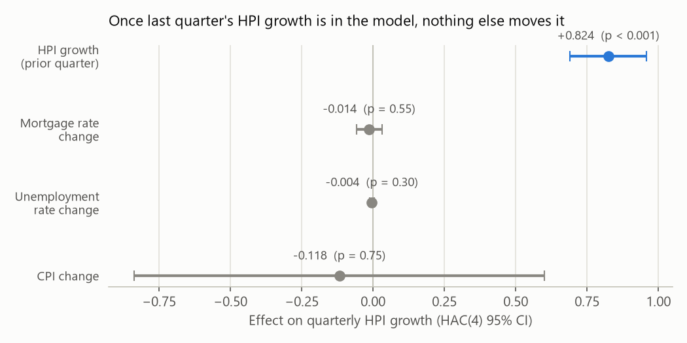
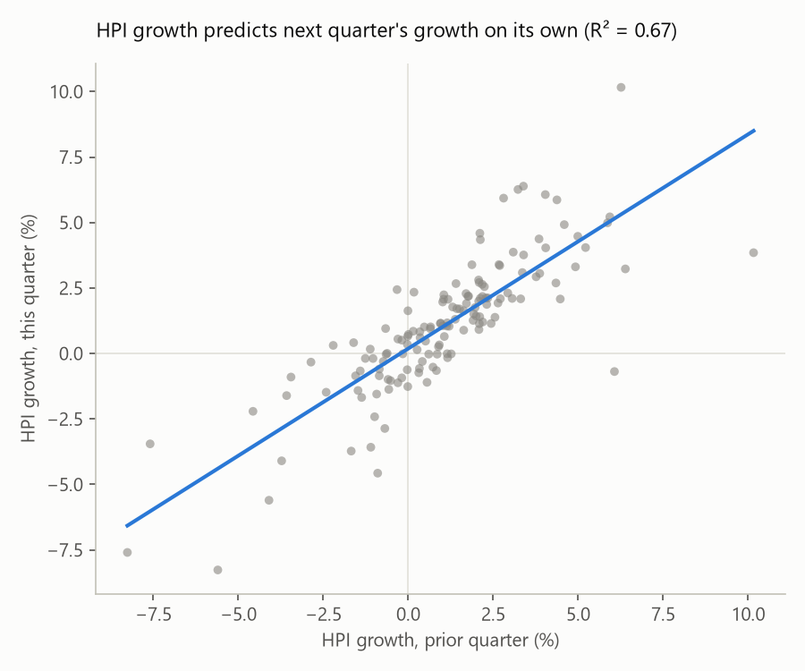

# California House Price Pipeline

A scheduled data pipeline that pulls five California housing-related series
from FRED, fits a statewide house price model, and builds a metro-level
cross-section for a Power BI dashboard. Originally a one-off analysis script,
rebuilt here as a containerized job running on a schedule against a
persistent volume.

## The finding

California house price growth is dominated by its own momentum. Once a one
quarter lag of HPI growth is in the model, quarter-over-quarter changes in
mortgage rates, unemployment, and inflation add nothing.





Statewide changes model, HAC(4) standard errors, 1990Q1 through 2024Q4, 140
quarters, 138 observations in the changes regression.

| Term | Coefficient | p |
|------|------------|---|
| HPI_chg_lag1 | 0.8245 | <0.001 |
| Mortgage_30yr_chg | -0.0136 | 0.556 |
| Unemployment_Rate_chg | -0.0042 | 0.306 |
| CPI_chg | -0.1159 | 0.762 |

R-squared 0.673, Durbin-Watson 2.012. A levels version of the same
relationship, kept only for contrast, gets R-squared 0.903 with a
Durbin-Watson of 0.080, which is the spurious-trend result the changes model
exists to avoid, not a competing finding.

Because this is now a scheduled job, `model.py` does not pin its sample end
date to 2024Q4. START stays fixed at 1990-01-01 and END rolls forward to
whatever the latest complete quarter in the raw data is, so every cron run
picks up new quarters automatically. The table above is the finding as
reported against that window. Running the pipeline today reproduces the same
story against a longer, rolling sample (currently 1990Q1 through 2026Q2, 146
quarters), with HPI_chg_lag1 still dominant at p on the order of 1e-33 and
the three macro terms still statistically indistinguishable from zero.

## Model diagnostics

`model.py` now runs four checks against its own design, and writes the
results into `model_output.json` alongside the coefficients, rather than
leaving the model's assumptions untested.

**Stationarity.** An Augmented Dickey-Fuller test on each series in levels
fails to reject a unit root for all four (p from 0.08 to 0.999), which is
the actual justification for modeling quarter-over-quarter changes instead
of levels. After differencing, HPI, mortgage rates, and unemployment are all
clearly stationary (p below 0.03); CPI is borderline (p around 0.06) but
close.

**Multicollinearity.** Variance inflation factors across the four predictors
run from 1.06 to 1.22, nowhere near a level that would suggest one
predictor's effect is being absorbed by another. The macro variables'
insignificance is a real null result, not multicollinearity in disguise.

**HAC lag sensitivity.** Refitting at HAC maxlags of 0, 1, 2, 4, and 8 leaves
the story unchanged at every setting. HPI_chg_lag1 stays significant at
p near zero throughout, and all three macro terms stay solidly
insignificant, with p-values between 0.3 and 0.8 regardless of lag length.
The result isn't an artifact of picking exactly 4 lags.

**Residuals.** The reported HAC(4) model's residuals fail a Jarque-Bera
normality test (fat-tailed, kurtosis around 5.6) and are flagged
heteroskedastic by a Breusch-Pagan test (p around 0.03). That's expected for
a housing series spanning the 2008 crash and the 2020 shock, and it's the
actual reason HAC standard errors, not plain OLS, are used for inference
here.

## Robustness checks

Three follow-up checks, prompted by comparing this project's results against
two specific published sources, also live in `model.py` and
`model_output.json`. Both sources are named directly rather than paraphrased
as "the literature," since a claim like this is only as good as the citation
behind it.

- Adam Guren, "House Price Momentum and Strategic Complementarity,"
  *Journal of Political Economy* 126(3), 2018, pp. 1172-1218.
- William D. Larson, "Effects of Mortgage Interest Rates on House Price
  Appreciation, The Role of Payment Constraints," FHFA Working Paper 22-04,
  2022.

**Does momentum extend past one lag, as Guren's research would predict.**
Guren documents house price serial correlation persisting 8 to 14 quarters,
well past the single lag the core model uses. Refitting HPI_chg on its own
lags 1 through 8 shows real information beyond lag 1, R-squared climbs from
0.669 at one lag to 0.716 at four, and BIC prefers 4 lags over 8, meaning
there's more here than the core model captures, but not an unbounded amount
more. The coefficients at higher lags alternate in sign (lag 2 negative, lag
3 positive), which turned out to have a specific explanation, see below.

**Does a delayed effect rescue any of the three macro variables, per
Larson's transmission mechanism.** Larson finds mortgage rate changes affect
house prices partly through payment constraints on borrowers, a channel that
plausibly takes more than one quarter to show up, and the core model here
only ever tests mortgage rate, unemployment, and CPI changes in the same
quarter as HPI growth. Testing each one at lags 0 through 3 instead
(controlling for HPI_chg_lag1) checks whether that kind of delayed effect is
present in this state-level, quarterly data. It isn't. No lag of any of the
three variables reaches significance, so a transmission delay isn't hiding
an effect the contemporaneous model missed, at least not one this
specification can detect.

**Is the core result an artifact of unremoved seasonality.** CASTHPI, the
exact FRED series this project pulls, is officially Not Seasonally Adjusted,
and there is no seasonally-adjusted state-level alternative published on
FRED. Mean HPI_chg does differ by calendar quarter across the sample
(roughly 0.84 percent in Q1 versus 1.33 percent in Q3, 1990 to present),
which is a real, decades-long pattern, not noise. Adding calendar-quarter
dummies to the core model leaves HPI_chg_lag1 essentially unchanged (0.824
becomes 0.842, still significant at p near zero), so the headline finding
survives. Two supporting numbers move, though, and reporting the original
figures without this check would have overstated how settled they are.
Unemployment_Rate_chg shifts from clearly insignificant (p 0.31) to
borderline (p 0.07), and CPI_chg's point estimate roughly triples in size
(-0.12 to -0.43) while staying insignificant either way. Separately, adding
the same calendar-quarter dummies to the 4-lag HPI-only model from the
momentum check above barely changes its alternating-sign pattern, and the
dummies themselves stop being significant once 4 HPI lags are already
included. That means the AR(4) model's own lag structure is already
absorbing most of the seasonal signal on its own, rather than the
alternating signs being a separate, unexplained problem.

## FRED series

| Name | ID | Notes |
|------|-----|-------|
| HPI | CASTHPI | FHFA all-transactions, California, quarterly |
| Mortgage_30yr | MORTGAGE30US | Freddie Mac PMMS 30 year, weekly |
| Unemployment_Rate | CAUR | California, monthly |
| CPI | CUUR0400SA0 | CPI-U West region, monthly |
| Permits | CABPPRIV | CA private housing units authorized, monthly |

The CPI series is CPI-U for the West region, not Los Angeles. An earlier
version of this project's code had a comment claiming the CPI series was Los
Angeles specific. It wasn't ever pulling a Los Angeles-only series; the
comment was simply wrong. The Los Angeles series, CUURA421SA0, was
discontinued in December 2017 as part of a BLS geographic revision, which is
presumably why an LA-specific series was never a live option for a pipeline
meant to run today. The comment is now fixed in `fetch.py`.

All series are resampled to quarterly means before modeling.

## Locked decisions

These are choices made deliberately during the rebuild, not defaults left
unexamined.

**Permits is fetched and validated like the other four series, and excluded
from the regression.** It was previously fetched, resampled, and never used
in the model, while still constraining the sample through a `dropna()` call
that happened to include it. That's a silent sample constraint from a column
nobody was looking at. `model.py` now drops Permits from the regression
frame explicitly, with the reasoning recorded in the module docstring and in
`model_output.json`'s notes field, rather than leaving it in by accident.

**Everything writes to disk.** `fetch.py` writes each raw series to
`data/raw/` as parquet, at its native reporting frequency, not resampled.
`model.py` reads that parquet, resamples to quarterly itself, and writes
`data/model_output.json`. A scheduled job that leaves no artifact behind
would defeat the point of running on a schedule.

**Validation runs on every fetch.** Because this pulls from a live API on a
schedule, it can fail in ways a static, already-downloaded dataset can't.
`fetch.py` asserts on row count, date coverage back to 1990-01-01, plausible
value ranges per series, and staleness of the most recent observation
against a threshold set per series' normal reporting lag. A failed assert
exits with a nonzero status and prints to stderr, so the job fails loudly
instead of writing partial or bad data.

**The API computes nothing.** `src/api.py` is a FastAPI service with three
routes, `/health` for the k8s probes, `/model` (the full contents of
`model_output.json`, unmodified), and `/model/coefficients` (just the
changes-model coefficient table). It reads whatever the fetch-and-model job
most recently wrote to the volume, mounted read-only. If the volume is empty
or the file isn't there yet, every route that needs it returns a 503 with a
clear message rather than falling back to fetching or fitting anything
itself, which was verified directly by removing `model_output.json` and
confirming the 503.

**The metro cross-section stays, reframed as Power BI data prep, not a
regression dataset.** The 24 row build (4 CBSAs by 6 dates in 2024) was
diagnosed as effectively 6 time points repeated four times. HPI and both
macro series vary by date only, carrying no cross-metro information at all,
and only CPI genuinely varies by metro, with a null coefficient at p equal
to 0.97 when tested. `src/build_metro_panel.py` now documents this plainly
in its module comment rather than presenting the output as something it
isn't. The wide CBSA-month grid is what the Power BI dashboard was always
actually for.

**Power BI stays as a cleaned .pbix plus screenshots**, not served from the
cluster, which isn't something Kubernetes can do for a desktop BI tool. The
API is reachable from the host at `localhost:8080` while the kind cluster is
running, so Power BI Desktop's Web connector can pull `/model/coefficients`
directly (Get Data > Web) rather than the dashboard only ever reading static
CSVs. That's still local-only, it works because the cluster is running on
the same machine, not because anything here is publicly hosted. Not yet
reworked to match the statewide model (see "What's left").

**Test.py is cut.** It imported the metro cross-section script as a module,
which re-ran the entire build as a side effect just to print column names.

**The earlier Word writeup does not go in this repo.** It had figures from
2023 mislabeled as 2024, and several appendices that were visibly AI
generated. This README replaces it.

## Repository layout

```
src/
  fetch.py               # pull + validate five FRED series, write parquet
  model.py               # changes model with HAC(4) and diagnostics, writes JSON
  api.py                 # FastAPI, reads volume, computes nothing
  make_figures.py        # local-only, generates the two PNGs in figures/
  build_metro_panel.py   # Power BI data prep, reframed per the note above
k8s/
  kind-config.yaml
  pvc.yaml
  cronjob.yaml
  deployment.yaml         # runs the API, verified against the kind cluster
  service.yaml            # NodePort 30080, verified against the kind cluster
dashboard/               # .pbix + screenshots (not yet built)
docs/
  architecture.md
data/                    # gitignored, local only
figures/                 # coefficient plot + momentum scatter
Dockerfile
README.md
requirements.txt
```

One image, two entrypoints. The Dockerfile's default command chains
`fetch.py` then `model.py`, which is what the CronJob runs. The Deployment
overrides that same image's command to run `uvicorn src.api:app` instead, so
nothing about the image changes between the batch job and the API.

## Running it

PowerShell, from the repo root, with the venv activated.

```powershell
.venv\Scripts\Activate.ps1
python src\fetch.py             # pulls and validates the 5 FRED series, writes data\raw\*.parquet
python src\model.py             # fits the model, writes data\model_output.json
python src\build_metro_panel.py # builds the Power BI cross-section
python src\make_figures.py      # regenerates figures\*.png from the above (needs matplotlib)
uvicorn src.api:app --reload    # serves model_output.json at localhost:8000
```

### In Docker

```powershell
docker build -t ca-housing-pipeline:dev .
docker run --rm -v "${PWD}\data:/app/data" ca-housing-pipeline:dev
```

This runs the same chained fetch-then-model command the CronJob uses,
against a host-mounted `data/` directory instead of a PVC.

### On a kind cluster

```powershell
kind create cluster --name ca-housing --config k8s\kind-config.yaml
kind load docker-image ca-housing-pipeline:dev --name ca-housing
kubectl apply -f k8s\pvc.yaml
kubectl apply -f k8s\cronjob.yaml
kubectl apply -f k8s\deployment.yaml
kubectl apply -f k8s\service.yaml
```

Once the Deployment's pod is ready, the API is reachable from the host at
`localhost:8080` (the NodePort mapping reserved in `kind-config.yaml`),
independent of whether the CronJob has run yet.

```powershell
curl http://localhost:8080/health
curl http://localhost:8080/model/coefficients
```

The CronJob is scheduled daily at 06:00 UTC. To trigger a run immediately
instead of waiting for the schedule, run a one-off Job from the same spec.

```powershell
kubectl create job --from=cronjob/fetch-and-model manual-test
kubectl logs job/manual-test
```

This was tested end to end during the build. A Job created this way ran
successfully against the PVC, and after deleting that Job's pod entirely, a
fresh pod mounted the same PVC and could still read every parquet file and
`model_output.json` it had written, which is the actual point of using a
PVC instead of the container's own filesystem.

## What's left

Per the build order this project followed, Day 1 and Day 2 are done. Of Day
3, the API and its Deployment/Service are done and verified; the dashboard
is not.

- Power BI dashboard rework to match the statewide model, plus screenshots
  in `dashboard/`. The rework can pull `/model/coefficients` live from the
  API (see "Locked decisions" above) rather than only reading static CSVs.

If the Kubernetes pieces hadn't been working by the end of Day 2, the plan
was to cut the FastAPI service and let Power BI read the CronJob's output
directly. That fallback wasn't needed. Docker, the CronJob, the PVC, the
API, and its Deployment and Service all work as built, verified above.
